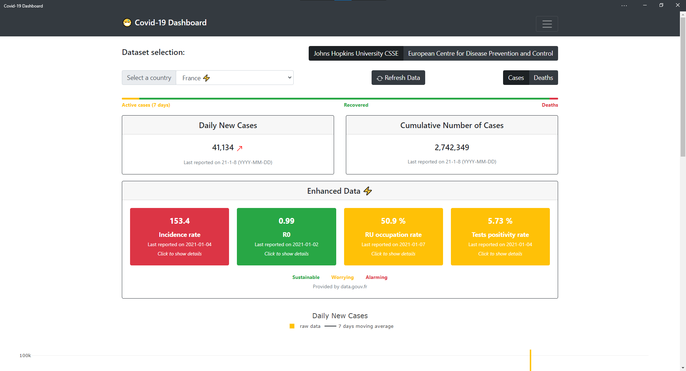
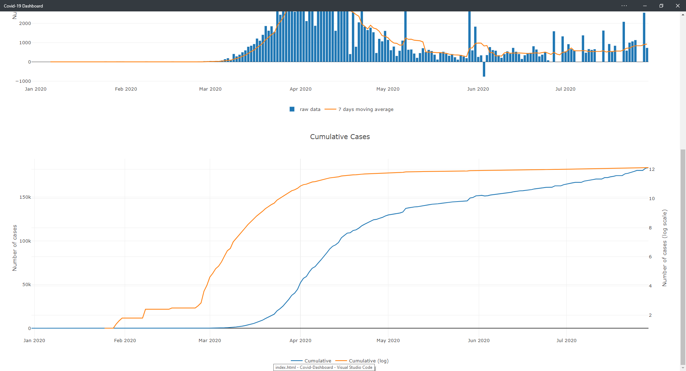
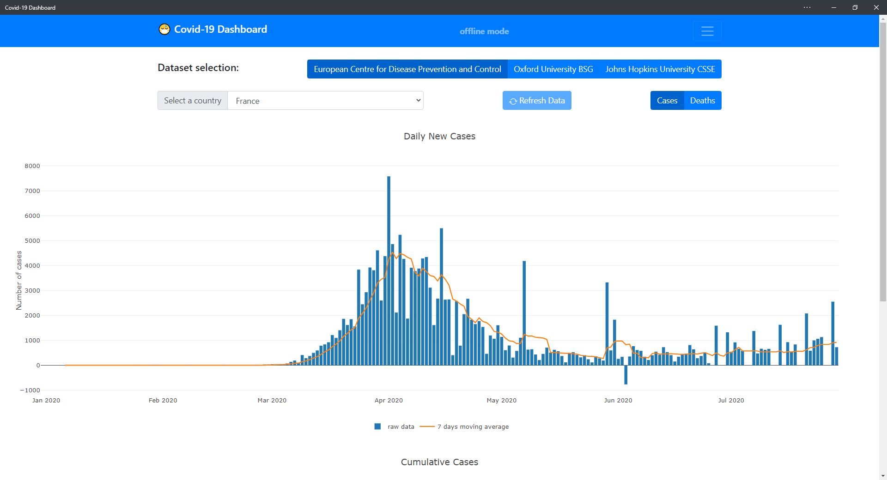

# :mask: Covid-19 Dashboard
A simple dashboard

## Static version on Github Pages

[GO !](https://krusty-is-cool.github.io/Covid-Dashboard/)

Only HTLM, CSS (Bootstrap CDN) and JavaScript. No server control.

Progressive Web App standard. You can install it on you desktop and your mobile devices. There is a service worker which manages caches to keep the app available when the device is offline. In addition, it slightly improves the performances. The dynamic cache that stores the datasets renews itself every hour, although datasets are updated daily.

**Do not reload the page when you are offline. The user experience in that case is not yet satisfying.**

### Tested on:
| OS | Browser | Status |
| :------: | :------: | :------: |
| Windows 10 | Microsoft  Edge 80 | Ok |
| Windows 10 | Google Chrome | Ok |
| iOS 13 | Safari | Ok issue #10 is closed |
| iPadOS | Safari | Ok issue #10 is closed | 
| Android 9 | Google Chrome | Ok |

### Features

Select a country and get a nice graph of the daily new Covid-19 cases and deaths in this country. Moving average on 7 days to filter the data.

Choose between three major wordwide datasets:
- [European Centre for Disease Prevention and Control](https://www.ecdc.europa.eu/en/publications-data/download-todays-data-geographic-distribution-covid-19-cases-worldwide).
- [University of Oxford Blavatnik School of Govvernment](https://covidtracker.bsg.ox.ac.uk/)
- [Johns Hopkins University Centre for Systems Science and Engineering](https://github.com/CSSEGISandData)

Default country: France. Need to study the possibility to set default country depending on user's location.

Warnings (not exhaustive):
> Note: On 3 July the  UK announced an ongoing revision of historical data that lead to a negative number of new cases and an overall decrease in cases for the UK.

### Screenshots *(desktop)*

#### Online mode

#### Offline mode

