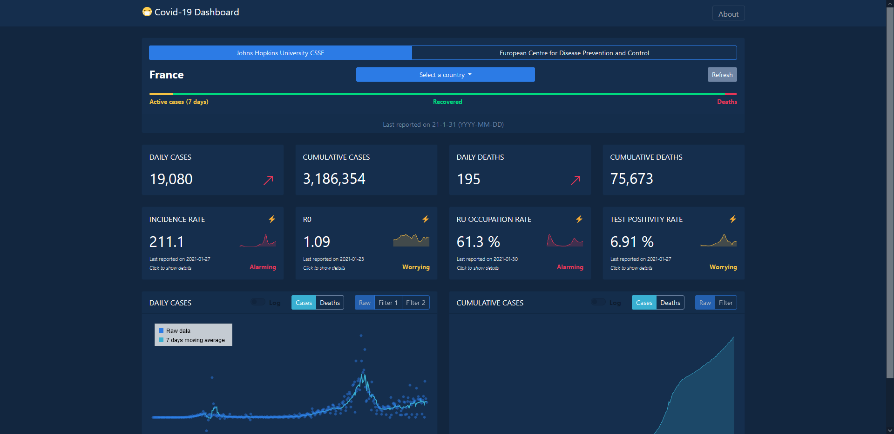
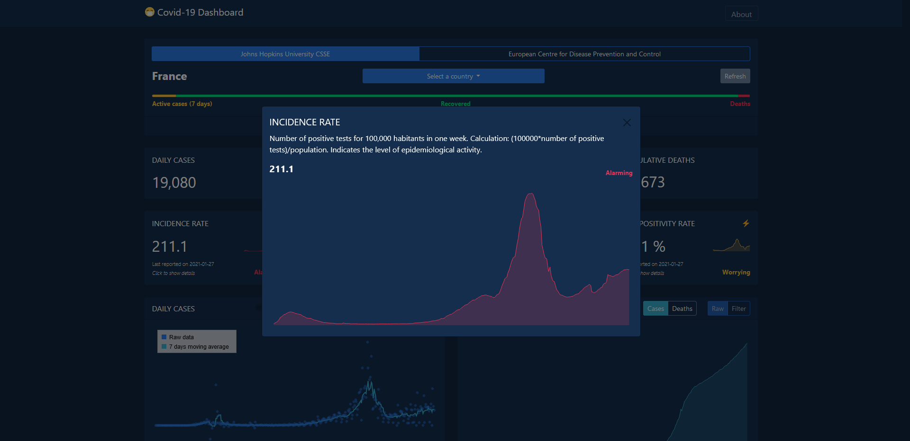
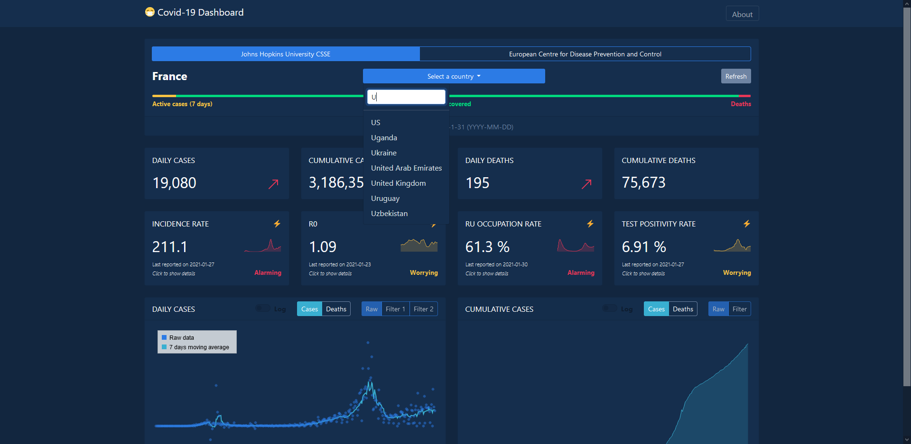

# :mask: Covid-19 Dashboard
A simple dashboard

## Static version

[GO !](https://www.coviddash.app/)

Only HTLM, CSS (Bootstrap) and JavaScript. No server control on this repository. There is a flask (python) based back-end to deliver datasets.

Progressive Web App standard. You can install it on you desktop and your mobile devices. There is a service worker which manages caches to keep the app available when the device is offline. In addition, it slightly improves the performances. The dynamic cache that stores the datasets renews itself every hour, although datasets are updated daily.

### Tested on:
| OS | Browser | Status |
| :------: | :------: | :------: |
| Windows 10 | Microsoft  Edge 80 | Ok |
| Windows 10 | Google Chrome | Ok |
| iOS 14 | Safari | Ok |
| iPadOS 14 | Safari | Ok | 
| Android 9 | Google Chrome | Ok |

### Features

Select a country and get a nice graph of the daily/weekly new Covid-19 cases and deaths in this country. Moving average on 7 days to filter the data. 
**More features coming soon !**

Choose between ~~three~~ two major wordwide datasets:
- [European Centre for Disease Prevention and Control](https://www.ecdc.europa.eu/en/publications-data/download-todays-data-geographic-distribution-covid-19-cases-worldwide).
- ~~[University of Oxford Blavatnik School of Govvernment](https://covidtracker.bsg.ox.ac.uk/)~~
- [Johns Hopkins University Centre for Systems Science and Engineering](https://github.com/CSSEGISandData)

Default country: France. Need to study the possibility to set default country depending on user's location in respect of their privacy.

**Enhanced Data** for France. Get 4 indicators of the epidemiological activity. Source: [data.gouv.fr](https://www.data.gouv.fr/en/datasets/indicateurs-de-suivi-de-lepidemie-de-covid-19/)

### Screenshots *(desktop)*

